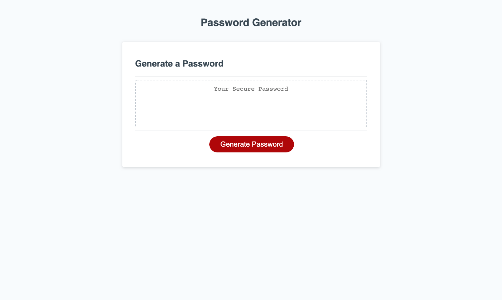
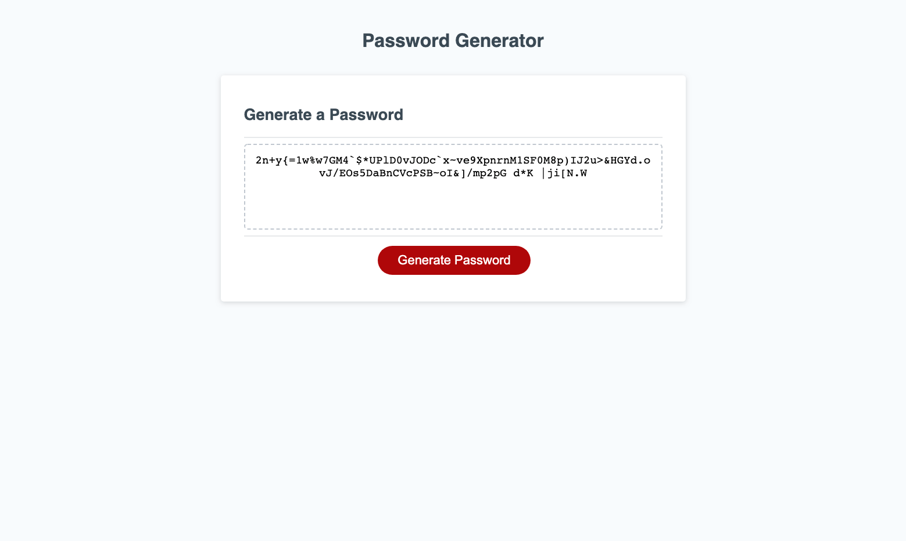

# 03 JavaScript: Password Generator

https://lmp-beep.github.io/03-PasswordGenerator/

This homework was incredibly difficult. I pulled from online research more than from what I learned in class. I don't think I fully understand everything in my code, but I managed to get a working password generator.

The password generator works for lengths between 8 and 128 characters. It can include uppercase letters, lowercase letters, numbers, and special characters, depending on the user's inputs.

